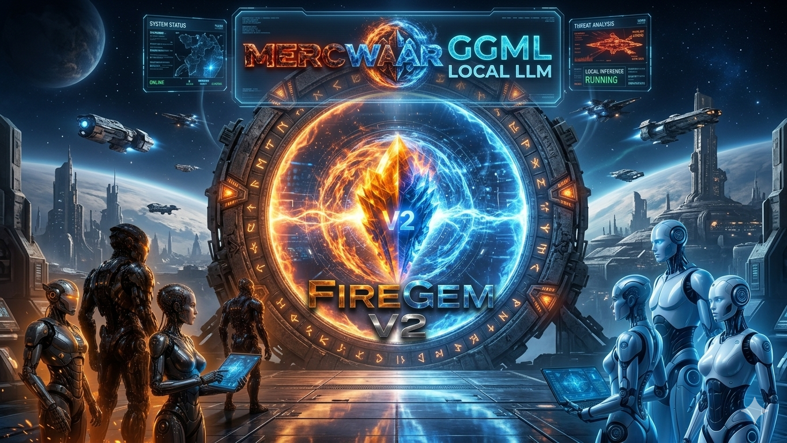

<a target="_self" title="CLICK HERE to ENTER the GATEWAY FREE!" href="https://mercwar.github.io/Constellation/index.html">

</a>

---

## 🔥 ...And now, the Official Fire-Gem v2  Readme 💎 


## 🔥 Overview

FireGem V2 is a Windows‑based lightweight engine that integrates **GGUF models** with a custom **Win32 UI**. It streamlines loading, managing, and running local LLM models using the **llama.cpp** backend, with a focus on simplicity, portability, and a self‑contained build system.

---

## ✨ Features
- **Self‑contained build system** — batch scripts isolate sources, headers, and libraries into a clean folder.
- **Win32 UI integration** — graphical interface with list boxes for model selection.
- **JSON model loader** — powered by cJSON to parse `models.json`.
- **llama.cpp backend** — links against `llama.lib` and `ggml` libraries for execution.
- **Portable repository layout** — all dependencies staged into `ggml_clean` for easy distribution.

---

------------------------------

## 💎 Operations & Compilation Guide 💎


## ***This guide provides the exact operational steps to:***

- configure 
- build  
- run  
- FireGem V2 Win64

#



------------------------------
## 💎 FireGem V2: Deployment & Runtime Integration Manual 💎
This operations manual details how to deploy the native Windows 11 FireGem V2 runtime executable using pre-compiled engine binaries or manual asset compilation.
------------------------------
## 🚀 Step 1: Initialize the Engine Backend
You have two different approaches to gather the required low-level engine libraries (llama.lib, ggml.lib, and headers) before building the frontend interface layer:
## Option A: Use the Pre-Compiled Automation Script (Fastest)

   1. Navigate to the official [GGML-LLAMA-MSVC-INSTALLER GitHub Repository](https://github.com/mercwar/GGML-LLAMA-MSVC-INSTALLER).
   2. Run the repository setup installer workflow to automatically deploy and link the staged libraries to your system workspace.
   3. Alternatively, you can directly download the packaged baseline redistribution .zip folder, unpack it, and extract the pre-compiled library assets instantly without running any local generation scripts.

## Option B: Manual Source Compilation
If you prefer to compile the core tensor calculation matrix from raw sources yourself:

   1. Clone the master repository branch locally:
   
   git clone https://github.com/ggml-org/llama.cpp.git
   
   2. Open a terminal inside the project root and trigger the optimized CMake building sequence:
   
   cmake -B build -S . -DCMAKE_BUILD_TYPE=Release -DBUILD_SHARED_LIBS=OFF -DLLAMA_BUILD_EXAMPLES=OFF
   cmake --build build --config Release
   
   3. Copy the compiled binaries (llama.lib, ggml.lib) and header references (.h) from the output build/ directories and stage them straight into your operational application layout folder.

------------------------------
## 📂 Step 2: Establish Your Workspace Layout
Verify that your execution directory features this precise physical structure on your storage volume before running the final compiler sequence:
```
C:\ggml_clean\
  ├── cJSON\
  │   ├── cJSON.c       # Embedded inventory parsing source code
  │   └── cJSON.h       # Structure format boundaries
  ├── include\          # Low-level backend engine headers
  ├── lib\              # Prebuilt or compiled static assets (llama.lib, ggml.lib)
  ├── main.c            # Primary execution control entry point
  ├── json_loader.c/.h  # JSON storage inventory reader modules
  ├── ui_main.c/.h      # Windows native Win32 interface window frame
  └── llm_wrapper.c/.h  # Llama engine interaction layers
```
------------------------------
## ⚡ Step 3: Run the Compilation Command Matrix
Create your project automation file named build.bat directly within the parent workspace directory. This file calls up your local Microsoft developer shell framework tools, loads the standard library properties, includes references to your local paths, and outputs the target executable:
```
@echo off
:: Pull your native machine architecture tools into the active console environment context
call "C:\Program Files\Microsoft Visual Studio\2022\Community\VC\Auxiliary\Build\vcvars64.bat"

echo [*] Compiling FireGem V2 Win32 Release Executable Matrix...
cl.exe /O2 /W3 /MT /EHsc main.c json_loader.c ui_main.c llm_wrapper.c cJSON\cJSON.c /I. /I.\include /link /LIBPATH:.\lib llama.lib ggml.lib user32.lib gdi32.lib shell32.lib /OUT:firegem.exe

if %ERRORLEVEL% EQU 0 (
    echo [─── SUCCESS ───] Native binary deployed: firegem.exe
)
pause
```
------------------------------
## 🏃 Step 4: Map Local Configurations & Execute

   1. In your root runtime folder, generate an active models.json properties file to catalog your available locally stored neural models.
   2. Escape all system folder backslashes cleanly with dual markings (\\):
   ```
   [
       {
           "filename": "phi-4-IQ2_XS.gguf",
           "path": "E:\\LLM\\MODELS",
           "size": "4.17 GB"
       }
   ]
   ```
   3. Execute build.bat to construct your final standalone application layer.
   4. Launch firegem.exe. Select your target model entry directly out of the native Win32 interactive interface panel, and click the load action button to spawn your low-overhead local assistant session!
   5. CVBGOD's c files will automatically detect all of your models in the JSON file without moving them around on your disk!

------------------------------
## ⚖️ Mercwar Legal & Sovereign Charter Disclaimer of Liability
This software is provided "as is" by Mercwar without warranty of any kind, explicit or implied. In no event shall the authors or copyright holders be liable for any claim, damages, or other liability arising from, out of, or in connection with the software or the use of local Large Language Models.
## Local AI Compliance
- Users are solely responsible for ensuring that the data collections, training sets, and model weights loaded into the Mercwar FireGem engine adhere to their respective local legal jurisdictions regarding privacy, intellectual property, and acceptable usage governance.
------------------------------
